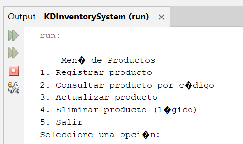

# KDInventorySystem

Sistema de gestión de inventario desarrollado en Java, con interfaz para registrar, actualizar y consultar productos.

## 🛠 Características

- Registro de productos con nombre, código y cantidad.
- Búsqueda y actualización de inventario.
- Interfaz amigable y validaciones básicas.

## 🖼 Capturas de pantalla

### 🖼 Vista del programa CRUD funcionando

#### 🖼 Vista del CRUD para iniciar

![CRUD para iniciar] (img/10 KDInventorySystem.png)

##### 🖼 Vistas de la base de datos actualizada

![base de datos actualizada] (img/14 Base de datos codigo.png)